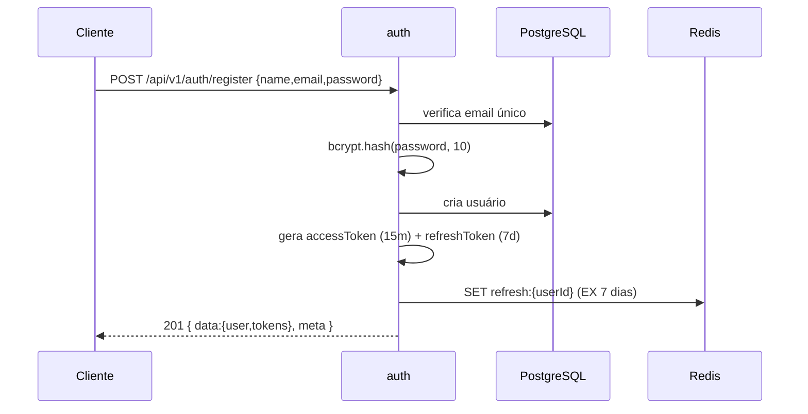
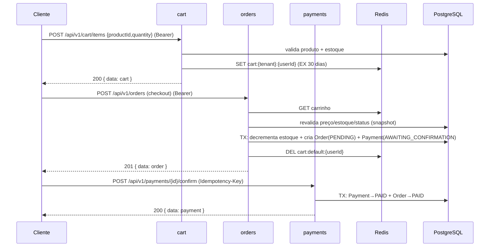
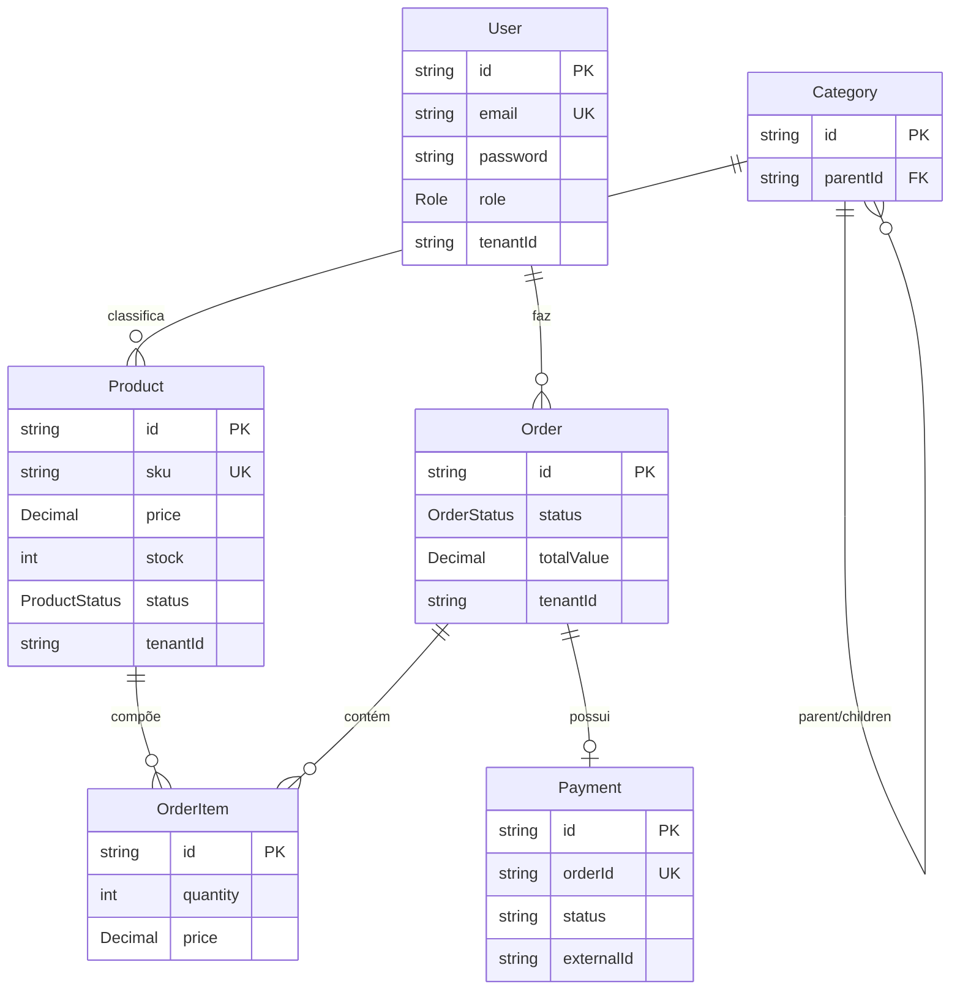

# Arquitetura — API E-commerce

> Documento gerado por análise do código-fonte na branch `docs/analise-arquitetura`.
> Complementado por entrevista de alinhamento com o time (ver seção *Contexto de Negócio*).

## 1. Objetivo e visão geral

API RESTful para um **e-commerce de acessórios infantis femininos** (laços, tiaras e afins). É um **produto real** — não um MVP descartável — projetado para ser consumido por **qualquer cliente**: aplicativos mobile, front-ends web SPA, parceiros B2B e integrações de terceiros. Por isso a API é *stateless* (autenticação via JWT), versionada (`/api/v1`) e desacoplada de qualquer front-end específico.

O sistema cobre o fluxo completo de compra:

1. **Cadastro e autenticação** de usuários (JWT access + refresh).
2. **Catálogo** de produtos organizado por **categorias hierárquicas**.
3. **Carrinho** de compras efêmero (mantido apenas no Redis).
4. **Pedidos** (checkout transacional com baixa de estoque).
5. **Pagamentos** (orquestração via gateway externo — Stripe).

### Stack tecnológica

| Camada | Tecnologia |
|--------|-----------|
| Runtime | Node.js 20 (Docker) / 18+ (local) |
| Framework HTTP | Express 5 |
| ORM | Prisma 7 (adapter `@prisma/adapter-pg`) |
| Banco relacional | PostgreSQL 15 |
| Cache / estado efêmero | Redis 7 |
| Autenticação | JWT (`jsonwebtoken`) + hashing `bcrypt` |
| Validação | `express-validator` |
| Segurança HTTP | `helmet`, `cors`, `compression` |
| Logging | `winston` + `morgan` |
| Gateway de pagamento | Stripe *(integração ainda não implementada — ver §6)* |

## 2. Arquitetura em camadas

O projeto segue uma **arquitetura modular por domínio** (feature-based), onde cada módulo isola suas próprias camadas. O fluxo padrão de uma requisição é:

```
HTTP → Router → (Middlewares: auth, validação) → Controller → Service → Repository → Prisma/Redis → DB
```

- **Router** (`*Routes.js`): define rotas, aplica middlewares (auth, admin, validação).
- **Controller** (`*Controller.js`): adapta HTTP ↔ domínio; nunca contém regra de negócio. Sempre encaminha erros via `next(error)`.
- **Service** (`*Service.js`): regras de negócio, orquestração, transações.
- **Repository** (`*Repository.js`): acesso a dados (Prisma). Isola o ORM da regra de negócio.

> ⚠️ **Desvio conhecido:** os módulos `auth` e `cart` **não possuem repository** — acessam Prisma/Redis diretamente no service. Ver [CONVENCOES.md](CONVENCOES.md) §Desvios.

### Diagrama de módulos e camadas

```mermaid
graph TD
    subgraph Client["Consumidores (mobile / web SPA / B2B / terceiros)"]
        C[HTTP JSON + Bearer JWT]
    end

    C -->|/api/v1| APP[Express App - server.js]

    subgraph Middlewares
        MW1[helmet / cors / compression]
        MW2[httpLogger - morgan]
        MW3[authMiddleware]
        MW4[validateRequest]
        MW5[errorHandler]
    end

    APP --> MW1 --> MW2 --> ROUTES

    subgraph ROUTES["Módulos (routes → controller → service → repository)"]
        AUTH[auth]
        USERS[users]
        PROD[products]
        CAT[categories]
        CART[cart]
        ORD[orders]
        PAY[payments]
    end

    MW3 -.protege.-> CART
    MW3 -.protege.-> ORD
    MW3 -.protege.-> PAY
    MW3 -.protege.-> USERS
    MW3 -.protege writes.-> PROD
    MW3 -.protege writes.-> CAT

    AUTH --> DB[(PostgreSQL / Prisma)]
    USERS --> DB
    PROD --> DB
    CAT --> DB
    ORD --> DB
    PAY --> DB

    AUTH -->|refresh tokens| REDIS[(Redis)]
    CART -->|estado do carrinho| REDIS
    PROD -->|cache de listagem| REDIS

    PAY -.->|orquestração futura| STRIPE[[Stripe API]]

    ROUTES --> MW5
```



## 3. Fluxos principais de ponta a ponta

### 3.1 Registro / Login



### 3.2 Carrinho → Checkout → Pagamento



> **Nota sobre snapshot de preço:** o preço final do pedido é recalculado no checkout a partir do banco (`orderService.checkout`), não do carrinho, evitando manipulação de preço no cliente. O valor pago é gravado em `order_items.price` como *snapshot* histórico.

## 4. Modelo de dados



- **Carrinho não é persistido no PostgreSQL** — vive apenas no Redis sob a chave `cart:{tenantId}:{userId}` (TTL 30 dias). É intencionalmente efêmero.
- `Payment.status` é uma `String` livre (`AWAITING_CONFIRMATION` → `PAID` / `CANCELED`), **não** um enum — diferente de `Order.status` (enum `OrderStatus`).
- FKs usam `ON DELETE RESTRICT` (exceto `Category.parentId` que é `SET NULL`), o que impede deletar usuários/produtos com pedidos associados.

## 5. Dependências externas

| Dependência | Uso | Observação |
|-------------|-----|-----------|
| **PostgreSQL 15** | Persistência (users, catálogo, pedidos, pagamentos) | Via Prisma 7 + adapter `pg`. Container `api_postgres`. |
| **Redis 7** | Carrinho (efêmero) + refresh tokens + cache de listagem de produtos (TTL 60s) | Container `api_redis`. Segundo o time, poderá também cachear catálogo dos principais produtos. |
| **Stripe** | Gateway de pagamento | **Ainda não integrado no código** — `Payment` é criado como *stub* (`externalId` nulo). Ver §6. |

O carrinho ser mantido no Redis significa que **perda de dados do Redis = perda de carrinhos ativos** (aceitável por serem efêmeros), mas refresh tokens também vivem lá — perder o Redis desloga todos os usuários.

## 6. Decisões arquiteturais e trade-offs

| Decisão | Motivação | Trade-off / risco |
|---------|-----------|-------------------|
| **Arquitetura modular por domínio** | Coesão alta, fácil localizar código de um domínio | Padrão de camadas não é uniforme (auth/cart sem repository) |
| **Carrinho no Redis, não no Postgres** | Performance, TTL automático, carrinho é efêmero por natureza | Não há histórico de carrinho; perda do Redis perde carrinhos ativos |
| **JWT stateless (access 15m + refresh 7d)** | Escala horizontal sem sessão no servidor | Access token não pode ser revogado antes de expirar; refresh depende do Redis |
| **Preço recalculado no checkout (snapshot)** | Evita fraude de preço no cliente; preserva histórico | Cliente pode ver preço diferente entre carrinho e checkout se houver mudança |
| **Baixa de estoque dentro de transação Prisma** | Consistência de estoque | Decremento **não é condicional** (`stock >= qty` está comentado) → risco de corrida sob concorrência alta (ver CONVENCOES §Regras de negócio) |
| **Pagamento como orquestração (não toca cartão)** | Reduz drasticamente escopo de PCI-DSS (enquadra em SAQ A) | Depende de integração Stripe ainda pendente |
| **Multi-tenancy via `tenantId`** | Preparar isolamento por loja/cliente | **Não implementado de fato** — nenhuma query filtra por `tenantId` (ver §7) |
| **Swagger preparado mas desabilitado** | Documentação de API planejada | Código comentado em `server.js`; sem `swagger.yaml` |

## 7. Contexto de negócio e compliance (da entrevista)

- **Público:** qualquer consumidor (mobile, web SPA, B2B, terceiros).
- **Multi-tenancy:** o time considera que `tenantId` **deve ser usado** de fato. Hoje ele existe no schema e no `cartService` (parâmetro com default `'default'`), mas **nenhum controller o propaga e nenhuma query filtra por ele** — é efetivamente um *placeholder*. Recomendação registrada como backlog.
- **PCI-DSS:** **não se aplica no nível pesado.** Como o backend usa Stripe e **não armazena/processa/transmite dados de cartão** (o cartão vai do cliente direto para a Stripe via `clientSecret`), o sistema se enquadra no questionário simplificado **SAQ A**. Manter essa fronteira é a principal medida de compliance de pagamento.
- **LGPD:** requisito ativo. Gaps atuais e recomendações estão detalhados em [CONVENCOES.md](CONVENCOES.md) §LGPD.

## 8. Como executar localmente

```bash
# 1. Dependências
npm install

# 2. Variáveis de ambiente (.env na raiz — ver README.md)
# 3. Infra (Postgres + Redis)
docker compose up -d

# 4. Migrações
npm run migrate

# 5. API em modo dev
npm run dev        # nodemon src/server.js  → http://localhost:3000
```

Healthcheck: `GET /health` → `{ status: "UP", timestamp }` (⚠️ ainda **não** verifica DB/Redis de verdade — comentário `// Adicionar checks reais` em `server.js:44`).

## 9. Gaps arquiteturais em aberto

1. Integração real com **Stripe** (criação de PaymentIntent, `externalId`, webhooks de confirmação).
2. **Multi-tenancy** efetivamente aplicado (middleware de resolução de tenant + filtros em queries).
3. **Swagger/OpenAPI** ativado.
4. **Healthcheck** com verificação real de dependências.
5. **Suíte de testes** (unitária e de caixa-preta) — inexistente hoje (ver [CONVENCOES.md](CONVENCOES.md) §Testes).
6. **Reposição de estoque** ao cancelar pagamento (hoje não devolve).
